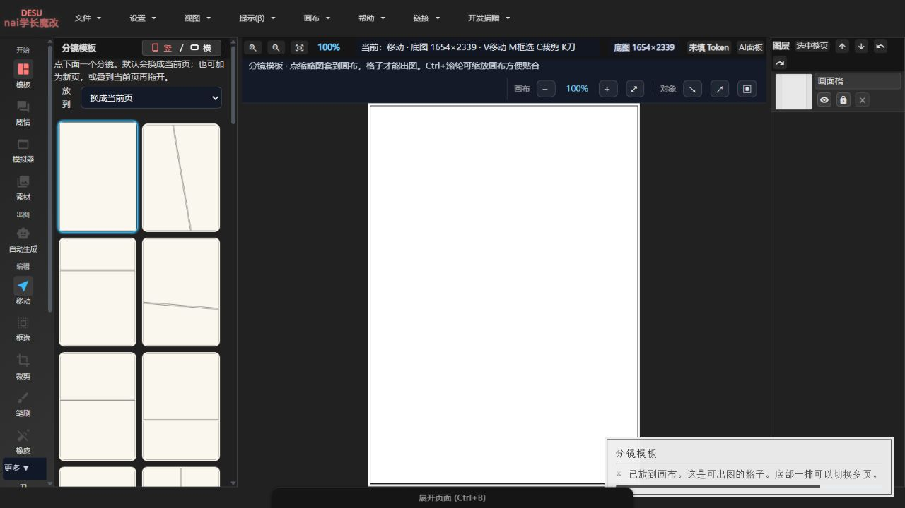

# Manga Editor Desu · NovelAI Edition

An unofficial GPL-3.0 modified distribution of [new-sankaku/manga-editor-desu](https://github.com/new-sankaku/manga-editor-desu). The upstream project provides the core editor: panels, speech bubbles, layers, knife tools, tones, brushes, and multi-page projects. This repository maintains the NovelAI integration, local launcher, simulator workspace, and a Chinese beginner workflow.

[中文](README.md) · [Releases](https://github.com/h1neolzr7f/Manga-Editor-Desu-NAI/releases/latest) · [Fork changelog](CHANGELOG.md) · [Contributing](CONTRIBUTING.md)



> Captured from the current `main` source through a local HTTP server with a built-in blank template. No NovelAI request, private artwork, or access token was used.

## Scope of this fork

| Area | Origin and responsibility |
| --- | --- |
| Panels, bubbles, layers, knife tools, tones, brushes, multi-page projects | Core editor from Manga Editor Desu |
| NovelAI text-to-image and image-to-image | Fork integration; requires the user's own token and may consume service credits |
| Windows local launcher | Starts an HTTP host to avoid `file://` restrictions |
| Simulator workspace | Generic chat, web, and UI components for screens inside comics |
| Beginner Chinese workflow | Grouped settings, hints, blank-canvas guidance, custom-page cutting, token status |
| Local cutout | Optional rembg sidecar with a color-key fallback |

See [NOTICE.md](NOTICE.md) and [CHANGELOG.md](CHANGELOG.md) for the modification boundary. Report fork-specific problems here; use the upstream tracker only when the same defect reproduces on unmodified Manga Editor Desu.

## Quick start

1. Download the complete installer or portable archive from [Releases](https://github.com/h1neolzr7f/Manga-Editor-Desu-NAI/releases/latest).
2. Extract the whole archive and run `一键启动.bat`, or launch the installed shortcut.
3. Open `http://127.0.0.1:8000/index.html` if the browser does not open automatically.
4. Add your own NovelAI token only when you want to generate images.

Do not open `index.html` through `file://`; the local host provides the expected static-file and proxy behavior.

Source requirements: Windows 10/11, Python 3, Chrome or Edge. Some batch asset tools also require Node.js.

```powershell
git clone https://github.com/h1neolzr7f/Manga-Editor-Desu-NAI.git
cd Manga-Editor-Desu-NAI
.\一键启动.bat
```

## Development and validation

```powershell
npm test
npm run test:simulator
npm run test:story-engine
npm run test:cutout
npm run test:proxy-guards
```

These offline checks cover layout, simulator chat, story flow, cutout presets, and proxy guards. See [docs/VALIDATION.md](docs/VALIDATION.md) for the observed result during this documentation pass. Tests that require a real NovelAI account, credits, or an external gateway are outside the default test scope.

The Windows packaging workflow is [.github/workflows/build-windows-installer.yml](.github/workflows/build-windows-installer.yml). It builds the installer, smoke-tests the installed runtime, and attaches release artifacts.

## Credentials and local data

- Never commit `.env`, access tokens, `user_data/`, or private comic projects.
- Generation may incur charges from the external service you configure.
- The local host is intended for one trusted desktop, not public multi-user hosting.

## License and credits

This modified distribution remains under [GNU GPL v3.0](LICENSE). Preserve the license, modification notices, and corresponding source when redistributing it. Third-party assets are documented in [THIRD_PARTY_NOTICES.md](THIRD_PARTY_NOTICES.md).

Thanks to [new-sankaku/manga-editor-desu](https://github.com/new-sankaku/manga-editor-desu) for the editor foundation.
