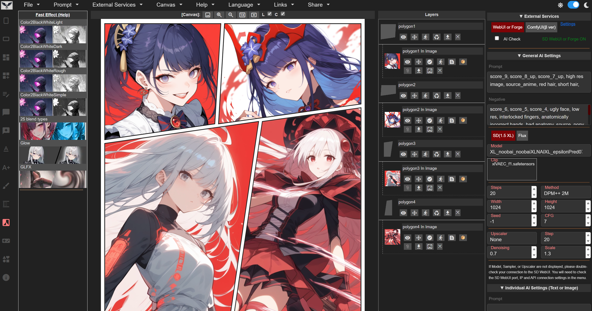

# Manga Editor Desu · NovelAI Edition

### NovelAI クリエイター向けのローカル漫画制作ワークスペース

**コマ・レイヤー · 吹き出し · NovelAI生成 · UIシミュレーター · ローカル切り抜き · Windowsワンクリック起動**

[中文](README.md) · [English](README_EN.md)

[最新版をダウンロード](https://github.com/h1neolzr7f/Manga-Editor-Desu-NAI/releases/latest) ·
[上流との差分](CHANGELOG.md) ·
[Issue](https://github.com/h1neolzr7f/Manga-Editor-Desu-NAI/issues)

  

編集機能の基盤は Manga Editor Desu から継承されています。本版の追加機能は以下と CHANGELOG に記載しています。

## この版の目的

上流版のコマ、吹き出し、レイヤー、ナイフ、トーン、ブラシ、複数ページ機能を維持しながら、画像生成部分を **NovelAI中心のローカル制作フロー**としてまとめた非公式版です。

| 追加機能 | 内容 |
|---|---|
| **NovelAI専用生成** | 不要なバックエンド設定を減らし、編集画面から文生図・図生図を実行 |
| **Windowsワンクリック起動** | バッチファイルからローカルサーバーと編集画面を起動 |
| **シミュレーター** | 漫画内のチャット、Webページ、汎用UI画面を作成 |
| **ローカル切り抜き** | 任意の rembg sidecar とカラキーのフォールバック |
| **初心者向け中国語UI** | 設定の整理、ツールヒント、閉じられる空キャンバス案内、カスタムページのコマ切り、Token状態 |
| **表示ツール** | Ctrl+ホイール拡大、ページ倍率、パネルに合わせる操作 |

## Windowsでの開始方法

1. [最新リリース](https://github.com/h1neolzr7f/Manga-Editor-Desu-NAI/releases/latest) を完全に展開します。
2. `一键启动.bat` を実行します。
3. `http://127.0.0.1:8000/index.html` が開くまで待ちます。
4. NovelAI設定に自分のアクセストークンを入力します。

`file://` で直接 `index.html` を開かないでください。画像生成には NovelAI のクレジットを使用します。

## 帰属とライセンス

本リポジトリは [new-sankaku/manga-editor-desu](https://github.com/new-sankaku/manga-editor-desu) の非公式 GPL-3.0 改変配布版であり、上流作者の公式リリースではありません。

変更点は [NOTICE.md](NOTICE.md) と [CHANGELOG.md](CHANGELOG.md) に記載しています。NovelAI、ランチャー、シミュレーター、切り抜きに関する問題は本リポジトリへ報告してください。

ライセンスは上流と同じ [GNU GPL v3.0](LICENSE) です。再配布時は対応するソース、LICENSE、NOTICE を保持してください。第三者素材は [THIRD_PARTY_NOTICES.md](THIRD_PARTY_NOTICES.md) を参照してください。
